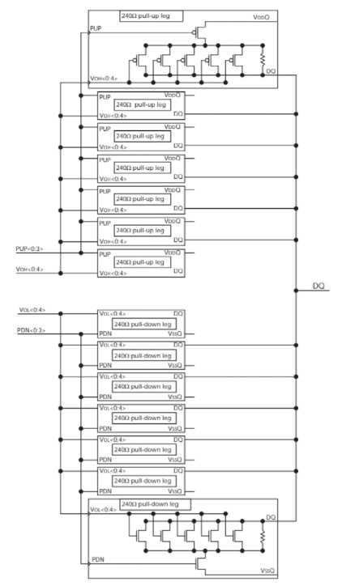
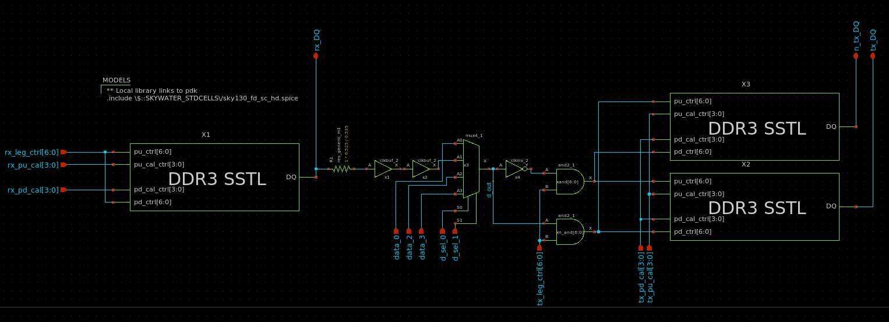

# DDR3 SSTL Caravel Analog Project

---

## Project Goal
The goal of this project is to test the an SSTL driver designed with entirely open source tools.
The SSTL circuit is designed to meet the DDR3 specifications.

## SSTL Function
The SSTL is a necessary part of a DDR3 memory controller. It is the driver circuit for the data lines, and also serves as the termination when the controller is receiving data.
Ideally, this cell would go under the IO pads for the data (DQ) pins for the memory interface.

Each SSTL driver contains 7 pull-up and 7 pull-down "legs". All 14 legs are in parallel. Each leg can be considered to be a controllable resistor. When enabled, a pullup leg will connect the DQ pin through a 240 ohm resistor to VDD. So the legs pulls up the DQ pin with 240 ohm impedance. When disabled, a pullup leg disconnects from the DQ pin (the leg makes a high impedance connection). 
Similarly, when enabled, a pulldown leg will connect the DQ pin through a 240 ohm resistor to VSS. Disabling a pulldown leg disconnects it from DQ.

 <kbd>  </kbd> 

 
<h4 align="center">SSTL Block Diagram (source: Micron TN4102)</h4>

Enabling and disabling legs is how the driver is switched from transmitting to receiving mode.

When driving DQ, the SSTL has some number of legs enabled on one side (up or down) and none of the legs enabled on the other side. So when driving DQ high, some number of pullup legs are enabled, and none of the pulldown legs are enabled. The specific number of pullup legs enabled controls the output impedance of the signal. When driving DQ low, the only pulldown legs are enabled. 

The DDR3 specification requires driving impedances to be configurable to 40 ohms and 34.29 ohms. The is achieved by the SSTL by enabling either 6 or 7 legs respectively.

When receiving, some number of legs are enabled on both the pullup and pulldown sides. This means the SSTL is actually driving DQ to the voltage VDD/2. It is expected the driving circuit on the other end has a much lower impedance so it can effectively control the voltage of DQ. 

The DDR3 specification requires termination impedances to be configurable to 120 ohms, 60 ohms, and 40 ohms. This achieved by SSTL be enabling (1 pullup and 1 pulldown), (2 pullup and 2 pulldown), and (3 pullup and 3 pulldown) legs respectively.

The additional feature an SSTL must have is the ability to fine tune the resistances of every leg to keep the resistance close to the required 240 ohms. The DDR3 spec includes a calibration procedure where the true SSTL drive strength is measured periodically. If it falls out of range, the leg resistances are adjusted. 
In this particular SSTL implementation, there are several calibration FETs in parallel with the main (polysilicon) resistor in each leg. In the low temperature or high voltage cases (where the leg has reduced resistance) some calibration FETs are turned off to increase the resistance back in spec. In the high temperature or low voltage cases, more calibration FETs are turned on.

## Chip Design Description

The goal of this chip is to test the performance of a SSTL circuit. The top level design is simple. A signal is fed into the chip (through the pin rx_DQ below). A receiving SSTL serves as configurable termination. The signal pass through a digital buffer, and then transmitted out through a differential pair of output SSTLs.

 <kbd>  </kbd> 

 
<h4 align="center">SSTL Test Circuit Schematic (using Xschem)</h4>

In the diagram above, rx_DQ is the data input, and tx_DQ, n_tx_DQ are the data outputs. The remaining signals are input configuration signals.
`tx/rx_leg_ctrl` signals enable the individual legs. This is the main impedance control.
`tx/rx_pu/pd_cal` signals control the calibration FETs within the legs.

As can be seen in the diagram, there are 3 alternate data inputs. This allows external signals to be substituted for the input signal.
In this design, `data_0` is tied to VDD, `data_2` is tied to VSS (ground) and `data_3` is connected to `la_data_out[0]`.
The ability to set the signal output to a static high or low voltage will be helpful when manually performing the calibration procedure in the lab.

## Pinout

| Caravel board pin | user project area port | Function |
| ----------------- | ---------------------- | -------- |
| IO[19]            | io_analog[5]           | Analog VDD (pwr) |
| IO[20]            | io_analog[6]           | Analog VSS (gnd) |
| IO[24]            | io_analog[10]          | Data in (rx_DQ on schematic) |
| IO[22]            | io_analog[8]           | Data out (tx_DQ on schematic) |
| IO[23]            | io_analog[9]           | Not data out (n_tx_DQ on schematic) |
| IO[18]            | io_analog[4]           | Digital VDD (pwr) |
| IO[17]            | io_analog[3]           | Digital VSS (gnd) |
| IO[25]            | gpio_analog[7]         | configuration data in |
| IO[26]            | gpio_analog[8]         | configuration clock in |

## Chip Configuration Interface

The configuration signals are set via a single shift register. The shift register is a chain of D-Flip-Flops. The user can set the register values with the clk_in and data_in signals.
The shift register has no "write enable" signal. A new bit will be registered on every rising edge of clk_in.

## Chip Configuration Register Space

| Config signal name | Shift register indexes |
| ------------------ | ---------------------- |
| rx_leg_ctrl[0:6]   | 0 to 6   |
| rx_pu_cal[0:3]     | 7 to 10  |
| rx_pd_cal[0:3]     | 11 to 14 |
| d_sel[0:1]         | 15 to 16 |
| tx_pd_cal[3:0]     | 17 to 20 |
| tx_pu_cal[3:0]     | 21 to 24 |
| tx_leg_ctrl[0:6]   | 25 to 31 |

*NOTE the different signal direction in some of the config signals!*

When writing a new bit in the config shift register, it goes into index 0, and the previously written signals get shifted up.
So if you write 32 new bits, the first written bit ends up at index 31, and the last written bit ends up in index 0.

---
